<div align="center">
  
  <h1>🐱 日报喵 (DailyBot)</h1>
  <p><b>工业级 · 全异步 · 插件化 · AI 驱动的日报自动化专家</b></p>
  <br />
  <a href="https://www.python.org/"></a>
  
  <a href="https://fastapi.tiangolo.com/"></a>
  <a href="LICENSE"></a>
  
  
  <a href="https://github.com/Youarefortunate/dailybot-miao/actions/workflows/test.yml"></a>
</div>

---

## 🌟 项目背景与简介

### 1. 为什么会有“日报喵”？
在现代软件开发流程中，开发者往往需要跨多个平台（GitLab, Jira, Redmine）记录自己的工作足迹。每到下班时分，手动整理成百上千条提交记录并撰写出一份逻辑清晰、重点突出的日报，往往耗时耗力。

**日报喵 (DailyBot)** 应运而生。它不仅是一个脚本，更是一个**智能化的工作伙伴**。它能自动潜入您的代码库，提取当日成果，通过 AI 智脑进行语义润色，并以最专业的形式推送到您的办公平台（飞书、企业微信等）。

### 2. 核心价值
- **自动化采集**：告别手动翻阅 Git Commit。
- **智能总结**：AI 自动过滤碎片化代码信息，提炼出具有业务价值的成果陈述。
- **极致体验**：支持 RPA 自动化填报，实现从采集到填报的全流程闭环。

---

## 🔥 核心特色功能

### 1. ⚡ 全链路异步深度重构
- **极速性能**：全程采用 `httpx` + `asyncio`，从 API 调用到数据落盘全异步化。
- **高并发支持**：多仓库采集任务通过 `asyncio.gather` 并行执行，即便有数十个仓库也能在秒级完成。

### 2. 🛡️ 智能 OAuth 引导 (Nudge)
- **Token 闭环管理**：实时监测 Token 有效性。若检测到未授权，系统会自动向群聊发送 **“智能引导卡片”**。
- **零中断授权**：用户仅需点击卡片按钮，系统即时捕获凭据并自动恢复工作流，无需人工干预配置文件。

### 3. 🧩 极致解耦的“插件化”架构
- **解耦设计**：支持动态扫描并加载 `Crawlers`（采集器）、`RPA`（执行器）和 `Providers`（AI 供应商）。
- **声明式 API**：仿前端 Axios 的声明式设计，业务逻辑只需关心调用，认证注入与异常拦截全自动化处理。

### 4. 🤖 智脑请求共享机制
- **模型去重**：若多个推送平台配置了相同的 AI 模型（如都用豆包），系统会自动合并请求。在单次运行中，相同模型的 AI 请求仅触发一次，极大节省 Token 消耗并保持总结的一致性。

- **冷启动与隐私保护**：利用 **LRU 冷却算法** 记录素材使用历史（`camouflage_history.json`），确保同一素材在指定冷却期内（如10天）绝不重复出现。
- **大师级变脸**：内置“性质反转”润色算法。AI 会智能将历史上的“新增功能”重构为当前的“优化、重构或修复”，使日报产出在任务空窗期依然保持高专业度。

### 6. 🔌 MCP 协议原生适配
- **即插即用（mcp）**：基于 `fastmcp` 实现，支持作为 MCP Server 接入 OpenClaw、Claude Desktop 等 AI 客户端。
- **能力暴露（skill function calling）**：直接在对话框中通过自然语言触发”运行日报”、”查询工作流”、”查看配置”等指令，实现真正的”对话式办公”。

### 7. 🌐 多代码源支持
- **GitLab / GitHub / Gitee**：支持三大主流代码托管平台作为提交记录采集源，配置灵活，切换无缝。

### 8. 🗄️ SQLite 持久化存储
- **轻量可靠**：内置 SQLite 数据库，缓存采集结果与运行记录，无需额外部署数据库服务。

### 9. 🖥️ Web 管理面板
- **可视化监控**：基于 FastAPI 构建的 Web 面板，实时查看运行状态与日报历史。
- **API Key 认证**：面板访问受 API Key 保护，安全可控。
- **访问地址**：`http://localhost:8001/admin/status?key=your_api_key`

### 10. 🐳 Docker 多阶段构建
- **一键部署**：提供 Dockerfile 多阶段构建，镜像体积小、启动快。
- **开箱即用**：基于 Playwright 官方镜像，内置 Chromium 浏览器核心，无需额外安装驱动。

---

## 🏗️ 技术架构全景图

```mermaid
graph TD
    subgraph ACCESS ["<span style='color:black;font-weight:bold'>0. 外部接入 (Access Layer)</span>"]
        USER_TALK[用户自然语言对话] --> CL[Agent: OpenClaw / Claude Code ....]
        
        subgraph "AI 增强平台 (AI Empowerment)"
            SKILL[DailyBot Skill<br/>SOP & Guidance]
            MCP_S[MCP Server<br/>Tools & Execution]
        end

        CL <-->|Matching & Thinking| SKILL
        CL <-->|Invoke & Control| MCP_S
        
        USER[用户双击 DailyBot.bat] -->|更新配置并退出| SCHEDULER
        EXE_USER[用户双击 DailyBot.exe] -->|更新配置并退出| SCHEDULER
        WIN_STARTUP[Windows 开机自启] -->|无感更新并退出| SCHEDULER
        
        MCP_S -->|Execution Trigger| START
    end

    subgraph SCHED_SUB ["<span style='color:black;font-weight:bold'>1. 原生定时任务流 (Scheduler Layer)</span>"]
        CONFIG_S["加载 config.yaml 配置"] --> SCHEDULER["dailybot_scheduler.py"]
        SCHEDULER -->|"先清理旧配置"| WIN_SCHED["向 Windows 系统注册日历闹钟"]
        WIN_SCHED -.->|"触发到达执行刻度"| SYSTEM_EXEC["--trigger 系统唤醒服务"]
        SYSTEM_EXEC --> LOCK["单例检测 & 进程防重锁"]
        LOCK -->|"检测到冲突锁退出"| ABORT["终止本次执行"]
        LOCK -->|"无运行实例 / 获取锁"| START
    end

    subgraph CHECKER ["<span style='color:black;font-weight:bold'>2. 环境自检 (System Checker)</span>"]
        START[程序启动] --> ENV[Playwright 驱动检测]
        ENV -->|未就绪| INSTALL[自动补全 Chromium]
        ENV & INSTALL --> OAUTH_CHECK{"各平台 OAuth 授权检测 (以飞书为例)"}
    end

    subgraph OAUTH_SUB ["<span style='color:black;font-weight:bold'>3. OAuth 流程 (Auth Layer)</span>"]
        OAUTH_CHECK -->|"检出过期"| FS_CHECK["飞书 Token 有效性校验"]
        FS_CHECK -->|"过期且可刷新"| FS_REFRESH["飞书 无感刷新 Refresh Token"]
        FS_REFRESH -->|"刷新失败 / 无凭据"| FS_CARD["发送飞书单聊授权卡片"]
        FS_CARD -->|"用户点击卡片授权"| FS_SUCCESS["更新凭据 & 自动重试工作流"]
    end

    subgraph CRAWLERS ["<span style='color:black;font-weight:bold'>4. 智能采集 (Crawlers Layer)</span>"]
        OAUTH_CHECK -->|授权通过| C_FACTORY[Crawler Factory]
        FS_CHECK & FS_REFRESH & FS_SUCCESS -->|授权通过| C_FACTORY
        C_FACTORY -->|异步并行| GL["GitLab (Async)"]
        C_FACTORY -->|Upcoming| GH["GitHub"]
        GL & GH --> RAW_DATA[原始 Commits 汇总]
        RAW_DATA -->|评估 threshold 条数| CAMOUFLAGE[Camouflage 伪装系统]
        CAMOUFLAGE -->|提取 lookback 历史并标记使用| MERGE_DATA[填充后的待总结报文]
    end

    subgraph PROVIDERS ["<span style='color:black;font-weight:bold'>5. 智脑中心 (Providers Layer)</span>"]
        MERGE_DATA -->|去重合并请求| AI_FACTORY[AI Factory]
        AI_FACTORY -->|Doubao| DB[豆包 Pro]
        AI_FACTORY -->|DeepSeek| DS[Claude Code 4.6]
        AI_FACTORY -->|Gemini| GM[Gemini 3.1 Pro]
        DB & DS & GM --> SUMMARY[AI 生成总结内容]
    end

    subgraph WORKFLOWS ["<span style='color:black;font-weight:bold'>6. 推送工作流 (Workflows Layer)</span>"]
        SUMMARY --> WF_FACTORY[Workflow Factory]
        WF_FACTORY --> FS[飞书卡片推送]
        WF_FACTORY --> WC[企业微信推送]
    end

    subgraph RPA_SUB ["<span style='color:black;font-weight:bold'>7. 自动化填报 (RPA Layer)</span>"]
        FS & WC --> RPA_FACTORY[RPA Factory]
        RPA_FACTORY -->|驱动| PW[Playwright Engine]
        PW --> SUBMIT[自动打开表单 & 模拟点击提交]
    end

    subgraph BUILD_FLOW ["<span style='color:black;font-weight:bold'>8. 打包与分发 (Build Layer)</span>"]
        B_USER[用户双击 build.bat] -->|一键触发| B_CORE[build.bat 逻辑]
        B_CORE -->|依赖检测| B_DEP[自动安装 pyinstaller]
        B_CORE -->|PyInstaller| B_EXE[编译 EXE]
        B_EXE -->|产物| B_DIST[dist/DailyBot.exe]
        B_DIST -.->|最终用户执行| EXE_USER
    end

    %% 节点样式定义
    classDef mainFlow fill:#6366f1,stroke:#4f46e5,color:#fff,stroke-width:2px;
    classDef actionNode fill:#10b981,stroke:#059669,color:#fff;
    classDef toolNode fill:#3b82f6,stroke:#2563eb,color:#fff;
    classDef logicNode fill:#f59e0b,stroke:#d97706,color:#fff;
    classDef skillNode fill:#8b5cf6,stroke:#7c3aed,color:#fff;
    classDef buildNode fill:#1e293b,stroke:#0f172a,color:#fff,font-weight:bold;
    classDef secondaryNode fill:#64748b,stroke:#475569,color:#fff;

    %% 应用样式
    class START mainFlow;
    class SUBMIT actionNode;
    class MCP_S toolNode;
    class SCHEDULER logicNode;
    class SKILL skillNode;
    class B_USER,B_CORE,B_DEP,B_EXE,B_DIST buildNode;
    class USER_TALK,EXE_USER secondaryNode;

    %% 子图样式
    style BUILD_FLOW fill:#f8fafc,stroke:#cbd5e1,stroke-dasharray: 5 5,color:#0f172a;
```


## 📂 项目结构解析

```text
DailyBot/
├── main.py              # 🚀 核心入口：控制全链路流转与浏览器自动环境初始化
├── dailybot_scheduler.py # ⏰ 守护进程：基于 Cron/轮询 规则的定时推送服务 (推荐入口)
├── config/              # ⚙️ 配置中心：config.yaml 静态配置存放
├── scripts/             # 🛠️ 运维脚本：PyInstaller 打包配置 (.spec) 与启动脚本
├── api/                 # 📡 接口定义：各平台声明式 API 映射
├── crawlers/            # 🔍 智能采集：各平台 Commits 爬虫实现
├── rpa/                 # 🖱️ 自动化执行：Playwright 驱动的表单自动填报逻辑
├── providers/           # 🤖 模型适配：各 AI 大模型的 Payload 与解析器
├── request/             # 🌐 通讯方案：底层 httpx 异步封装与平台拦截器
├── token_storage/       # 🗄️ 凭据存储：支持 Redis 或文件驱动
└── utils/               # 🔧 通用工具：动态模块发现器 (DynamicManager) 与路径助手
```

## 📦 项目打包 (EXE 单文件)

### 1. 一键构建与编译

只需通过项目中内置的自动化脚本即可重新进行编译发布：

- **标准打包**: 在 Windows 下，直接双击运行根目录的 `scripts\build.bat`。
- **清理重置**: 为清除历史构建缓存残余，请在终端中执行 `.\scripts\build.bat --clean` 获取纯净的编译效果。
- **手动打包**: 
  
  ```bash
  pyinstaller scripts/DailyBot.spec --clean --noconfirm
  ```
---

## ⏰ 定时任务 (Windows)

### 1. 极简配置驱动

一切行为仅受 `config.yaml` 驱动：
```yaml
scheduler:
  enabled: true       # 开启此项，系统才会在特定时间自动唤醒程序
  auto_start: true    # 开启此项，每次电脑开机时会隐形自动同步最新定时状态
  default_time: "18:20" # 每天雷打不动下班推送的时间点
  tasks:              # 进阶玩法：支持精细化周频调度
    - time: "18:30"                   
      weekdays: [1, 2, 3, 4, 5]        # 只有工作日一到五推送
    # - xxx # 可以继续定义
```

### 2. 配置生效方式

当您修改了 `config.yaml` 之后：
**只需重新双击运行一次** `DailyBot.exe`（开发环境下运行 `python dailybot_scheduler.py`）。程序会静默启动，将最新定时状态同步覆写到 Windows 底层，随后立刻退出，**新的执行计划即行生效**。

### 3. 可选命令行参数

如果需要进行运行维护或高级操作，您可以在终端中带参数运行 `DailyBot.exe`：

| 启动参数 | 核心功能 | 适用场景 |
| :--- | :--- | :--- |
| **(无参数默认双击)** | **更新与同步配置** | 修改 `config.yaml` 后，用于将最新时间参数同步更新至系统中。 |
| `--status` | **查看运行状态** | 弹出一个控制台面板，详细打印当前电脑中已注册的所有触发点及自启状态。 |
| `--uninstall` | **清理与反注册** | 彻底移除系统任务计划程序中的 DailyBot 相关任务，取消开机自启。 |
| `--trigger` | **立即触发执行** | 无视定时约束，强制立即执行一次数据采集、AI 总结与推送（此参数默认由系统按时自动调用）。 |

---

## 📡 Git 多远程仓库同步

本项目支持在 Gitee 和 GitHub 上同步维护。为了保持一致性，已将主分支规范化为 `main`。

### 1. 远程仓库配置
- **gitee**: 指向 Gitee 仓库，对应分支为 `master` (默认/主流)。
- **github**: 指向 GitHub 仓库，对应分支为 `main` (默认/现代)。

### 2. 如何推送？

由于 Gitee 和 GitHub 分支名称不同，我们已通过 Git 配置实现了**智能自动映射**。您在 `master` 分支下直接运行即可：

```bash
# ✅ 一键推送到所有平台 (Gitee master + GitHub main)
git push-all

# � 仅推送到 Gitee (自动对齐 master)
git push gitee

# 🔵 仅推送到 GitHub (自动对齐 main)
git push github
```

> **💡 高阶技巧**：我们保留了 `all` 远程作为“万能地址”，但由于 GitHub 对账号密码认证的限制，建议首选上述已配置 Token 的 `gitee` 和 `github` 独立推送。

### 3. 如何配置？

如果您需要为新环境配置多仓库协同流程，请参考以下步骤：

1. **统一分支名称**（推荐使用 `main`），此步骤会强制所有仓库平台都有一个分支`main`：
   
   ```bash
   git branch -M main
   ```
2. **配置各个远程仓库**：
   ```bash
   # 配置 Gitee (master)
   git remote add gitee https://gitee.com/youarefortunate/daily-bot.git
   git config remote.gitee.push master:master
   
   # 配置 GitHub (main，带 Token)
   git remote add github https://<YOUR_TOKEN>@github.com/Youarefortunate/dailybot-miao.git
   git config remote.github.push master:main
   
   # 配置一键同步别名 (真正的一键全量)
   git config alias.all "!git push gitee && git push github"
   ```
3. **验证配置**：
   ```bash
   git remote -v
   # 尝试一键推送
   git all
   ```
   *配置成功后，gitee 对应 master，github 对应 main，且 all 别名可一次性完成同步。*

---

## 🚀 快速开始

### 1. 配置环境
```bash
cp .env.example .env
# 编辑 .env 填入你的 API Key 和配置
```

### 2. 配置采集源
编辑 `config/config.yaml`，配置 GitLab/GitHub/Gitee 仓库。

### 3. 运行
```bash
pip install -r requirements.txt
python dailybot_scheduler.py --once
```

### 4. 访问管理面板（可选）
启动 OAuth 服务后访问:
```
http://localhost:8001/admin/status?key=your_api_key
```

---

## 🚀 极简上手指南

### 环境准备

```powershell
# 克隆项目并进入
git clone https://github.com/your-repo/DailyBot.git
cd DailyBot

# 创建并激活虚拟环境 (Windows)
python -m venv .venv
.\.venv\Scripts\activate

# 安装全量依赖
pip install -r requirements.txt
```

---

## ⚙️ 配置指南

### 1. 在项目根目录创建.env环境配置文件

配置优先级：外部`.env`配置 > 外部`config.yaml` > 内部`.env`配置 > 内部`config.yaml`

```properties
# 飞书应用配置
FEISHU_APP_ID=飞书appid
FEISHU_APP_SECRET=飞书秘钥
FEISHU_OAUTH_REDIRECT_URI=http://127.0.0.1:8001/feishu/callback # 授权配置回调地址
FEISHU_BASE_URL=https://open.feishu.cn # 请求库配置
# 机器人推送配置
FEISHU_TARGET_CHAT_ID=推送机器人id
FEISHU_STANDUP_TIME=09:00
FEISHU_STANDUP_TIMEZONE=Asia/Shanghai

# 豆包大模型配置
DOUBAO_API_KEY=火山方舟API Key
DOUBAO_BASE_URL=https://ark.cn-beijing.volces.com/api/v3
DOUBAO_MODEL=doubao-seed-1-8-251228

# 智普GLM
GLM_API_KEY=火山方舟API Key
GLM_BASE_URL=https://ark.cn-beijing.volces.com/api/v3
GLM_MODEL=glm-4-7-251222

# DeepSeek
DEEPSEEK_API_KEY=火山方舟API Key
DEEPSEEK_BASE_URL=https://ark.cn-beijing.volces.com/api/v3
DEEPSEEK_MODEL=deepseek-v3-2-251201

# Kimi K2
KIMI_API_KEY=火山方舟API Key
KIMI_BASE_URL=https://ark.cn-beijing.volces.com/api/v3
KIMI_MODEL=kimi-k2-thinking-251104

# Gemini
GEMINI_API_KEY=Google AI Studio上面的API Key
GEMINI_BASE_URL=https://generativelanguage.googleapis.com/v1beta
GEMINI_MODEL=gemini-3-flash-preview

LOG_LEVEL=INFO

# GitLab 配置
GITLAB_TOKEN=gitlab访问token
GITLAB_TARGET_USER=你的gitlab仓库对应git的用户名

# redis配置
REDIS_HOST=127.0.0.1
REDIS_PORT=6379
```

### 2. 火山方舟 (豆包 AI) 获取流程

日报喵默认推荐使用豆包模型，其针对中文总结进行了深度优化，且新用户拥有丰厚的免费额度。

1. **注册与登录**：访问 [火山方舟控制台](https://console.volcengine.com/ark/region:ark+cn-beijing/endpoint)。

   

   两处地方任意一处即可进入

   

   

2. **开通服务**：搜索并点击“豆包”系列模型（如 `doubao-seed-1-8-251228`），点击“开通服务”。

   

3. **获取 API Key**：在左侧导航栏【API Key 管理】中点击“创建 API Key”，复制生成的密钥到`.env`里面的`DOUBAO_API_KEY`等有关火山方舟大模型的ai都可以

   

4. **获取base_url和模型名称**：

   - 点击已经开通的模型名称进入对应ai的模型广场详情页面，在这里可以得到对应ai模型的名称（ID）和请求需要的基础url（base_url）

     

     

     将获取到的信息依次填写到对应的配置

     

   - > 新用户通常享有 **50 万免费 Token** 额度，建议优先开启“安心体验模式”以防意外扣费。

### 2. GitLab 配置流程
为了自动提取您的代码记录，需要配置 GitLab 访问凭据：

1. **生成 Token**：
   - 登录您的 GitLab，进入个人设置 -> **Access Tokens**。

     

   - 创建一个新的 Token，名称随意

   - **Scopes 建议全选** 。

     

   - 复制生成的 `Personal Access Token`。

     

2. **确认用户名**：`GITLAB_TARGET_USER` 填入您的 GitLab 登录用户名（用于精准过滤您的提交）。查看当前仓库使用的：

   ```bash
   git config user.name
   git config user.email
   ```

3. **启动项目**：

```bash
# 手动单次运行
python main.py

# 生产环境常驻运行 (支持热重启)
python dailybot_scheduler.py
```

---

## 🔌 MCP 协议接入

日报喵原生支持 **Model Context Protocol (MCP)**，可作为 MCP Server 接入各类 AI 客户端。

### 接入前提

- 建议使用**虚拟环境的 Python 绝对路径**作为 `command`，确保依赖隔离
- MCP Server 内置**启动自检机制**，首次启动时若检测到关键依赖（如 `fastmcp`）缺失，会自动执行 `pip install -r requirements.txt` 完成安装，无需手动操作

### 配置示例

<details>
<summary><b>Antigravity</b>（~/.gemini/antigravity/mcp_config.json）</summary>

```json
{
  "mcpServers": {
    "DailyBot": {
      "command": "D:\\daily-bot\\.venv\\Scripts\\python.exe",
      "args": ["-m", "mcp_server.server"],
      "cwd": "D:\\daily-bot",
      "env": {
        "PYTHONPATH": "D:\\daily-bot"
      }
    }
  }
}
```

</details>


> **📌 路径说明**：请将上述路径替换为你本地实际的项目路径和虚拟环境路径。

### 可用工具

| 工具名 | 说明 |
|:---|:---|
| `run_daily_report` | 触发完整的日报采集、AI 总结与推送流程 |
| `get_enabled_workflows` | 查看当前启用的工作流列表 |
| `get_system_config` | 获取脱敏后的系统配置摘要 |

### 已知注意事项

- **`cwd` 可能不生效**：部分 MCP 客户端（如 Cursor）设置的 `cwd` 参数不会实际改变进程的工作目录。为此，MCP Server 启动时会**自动通过 `__file__` 定位并切换到项目根目录**，确保 `config.yaml` 等配置文件始终能被正确加载，无需额外处理。
- **`PYTHONPATH` 环境变量**：建议在配置中指定 `PYTHONPATH` 指向项目根目录，确保模块导入路径正确。

---

## 🐳 TODO(待完善): Docker 快速部署

如果您希望在 Linux 服务器上快速部署，或避免本地 Python 环境冲突，可以使用 Docker 方案。

1. **环境准备**：确保已安装 Docker 和 Docker-compose。
2. **配置环境变量**：参考上文配置好 `.env` 文件。
3. **一键启动**：
   ```bash
   # 进入项目根目录执行
   docker-compose -f docker/docker-compose.yml up -d
   ```
4. **管理指令**：
   ```bash
   # 查看实时日志
   docker-compose -f docker/docker-compose.yml logs -f dailybot
   
   # 停止并移除容器
   docker-compose -f docker/docker-compose.yml down
   ```
> Docker 镜像基于 Playwright 官方 Python 镜像构建，已内置所需的浏览器核心，无需额外安装驱动。

---

---

## 🛠️ TODO(待完善v1): 配置文件手册

日报喵支持高度灵活的配置，您可以根据需要通过外置的 `.env` 或 `config/config.yaml` 进行定义。

### 1. 配置优先级
**环境配置挂载 > 外部工作目录配置 > 打包目录内置配置**
即：外部 `.env` > 外部 `config.yaml` > 内部 `.env` > 内部 `config.yaml`。

### 2. 环境变量 (`.env`) 详解
这些变量支持直接覆盖 YAML 中的对应点位，适合在本地部署或容器化环境中使用。
| 变量名 | 类型 | 说明 |
| :--- | :--- | :--- |
| **全平台通用** | | |
| `LOG_LEVEL` | String | 日志输出级别 (`DEBUG`, `INFO`, `WARNING`, `ERROR`) |
| **GitLab 数据采集** | | |
| `GITLAB_TOKEN` | String | GitLab 的 Personal Access Token (需 `read_api` 权限) |
| `GITLAB_TARGET_USER` | String | 目标作者用户名，用于过滤 Commit 记录 |
| `GITLAB_BASE_URL` | String | 自建 GitLab 的域名地址 |
| `GITLAB_REPOS` | String | (可选) 动态仓库，格式：`repo_path:branch,repo_path:branch` |
| **飞书推送平台** | | |
| `FEISHU_APP_ID` | String | 飞书应用的 App ID |
| `FEISHU_APP_SECRET` | String | 飞书应用的 App Secret |
| `FEISHU_TARGET_CHAT_ID` | String | 接收卡片的飞书群聊 ID |
| **企业微信推送平台** | | |
| `WECOM_CORP_ID` | String | 企业微信 CorpID |
| `WECOM_CORP_SECRET` | String | 企业微信应用 Secret |
| `WECOM_RPA_FORM_URL` | String | 企业微信日报填写页面的 URL |
| **AI 模型秘钥 (火山方舟等)** | | |
| `DOUBAO_API_KEY` | String | 豆包 Pro API 密钥 |
| `GLM_API_KEY` | String | 智谱 GLM-4 API 密钥 |
| `DEEPSEEK_API_KEY` | String | DeepSeek API 密钥 |
| `KIMI_API_KEY` | String | Kimi (Moonshot) API 密钥 |
| `GEMINI_API_KEY` | String | Google Gemini API 密钥 |
| **Redis 存储 (可选)** | | |
| `REDIS_HOST` | String | Redis 地址 |
| `REDIS_PORT` | Int | Redis 端口 (默认 6379) |
| `REDIS_PASSWORD` | String | Redis 密码 |

### 3. YAML 配置 (`config.yaml`) 详解

| 路径 | 类型 | 说明 | 默认/示例 |
| :--- | :--- | :--- | :--- |
| **全平台通用** | | | |
| `enabled_workflows` | List | 数组，定义哪些平台将执行推送 (如 `["feishu", "wecom"]`) | `[]` |
| **飞书 (feishu)** | | | |
| `platforms.feishu.ai_model` | String | 该推送平台使用的 AI 模型参考 key | `doubao` |
| `platforms.feishu.app_id` | String | 飞书应用的 App ID | `${FEISHU_APP_ID}` |
| `platforms.feishu.app_secret` | String | 飞书应用的 App Secret | `${FEISHU_APP_SECRET}` |
| `platforms.feishu.target_chat_id` | String | 接收日报卡片的群聊 ID | `oc_xxx` |
| `platforms.feishu.standup_time` | String | 每日推送的标准时刻 | `09:00` |
| `platforms.feishu.standup_timezone` | String | 时区设置 | `Asia/Shanghai` |
| `platforms.feishu.base_url` | String | 飞书开放平台地址 | `https://open.feishu.cn` |
| `platforms.feishu.oauth.port` | Int | OAuth 回调服务器端口 | `8001` |
| `platforms.feishu.oauth.host` | String | OAuth 回调服务器监听地址 | `0.0.0.0` |
| **企业微信 (wecom)** | | | |
| `platforms.wecom.ai_model` | String | 绑定的 AI 模型 key | `doubao` |
| `platforms.wecom.rpa.enabled` | Bool | 是否启用 Playwright 自动填报 | `true` |
| `platforms.wecom.rpa.speed` | Float | 模拟真人操作速度 (0.1 最快, 1 最慢) | `1` |
| `platforms.wecom.rpa.max_retry` | Int | 页面刷新重试次数 | `1` |
| `platforms.wecom.rpa.auto_submit` | Bool | 是否直接点击“提交”按钮 | `false` |
| `platforms.wecom.rpa.browser_type` | String | 内核选择: `chrome` 或 `msedge` | `chrome` |
| `platforms.wecom.rpa.form_url` | String | 企业微信日报汇总表单的 URL | `https://doc.weixin.qq.com/...` |
| `platforms.wecom.rpa.browser_executable_path` | String | 浏览器二进制文件的绝对路径 (留空则自动搜索) | `C:\Program Files\...` |
| **AI 模型 (models)** | | | |
| `models.xxx.name` | String | 模型的友好显示名称 | `豆包大模型` |
| `models.xxx.base_url` | String | 模型 API 的基础 URL | `https://ark...` |
| `models.xxx.model` | String | 模型名称或接入点 ID (Endpoint ID) | `ep-xxx` |
| `models.xxx.params.temperature` | Float | 生成多样性控制参数 | `0.7` |
| `models.xxx.params.timeout` | Int | 请求超时秒数 | `60` |
| **仓库源 (repos)** | | | |
| `repos.gitlab.base_url` | String | GitLab 服务器地址 | `http://git.xxx.com` |
| `repos.gitlab.target_user` | String | 核心开发者用户名 (自动过滤记录) | `liangan` |
| `repos.gitlab.repos[].path` | String | 仓库路径 (Group/Repo) | `frontend/admin` |
| `repos.gitlab.repos[].branch` | String | 监听的分支 (支持逗号分隔多个) | `master, dev` |
| `repos.gitlab.repos[].name` | String | 日报头部展示的项目名 | `管理后台` |
| `repos.gitlab.repos[].crawl_dates` | List | (可选) 指定爬取的历史日期 | `["2024-01-01"]` |
| **伪装补全 (camouflage)** | | | |
| `repos.gitlab.camouflage.enabled` | Bool | 是否启用伪装补全功能 | `true` |
| `repos.gitlab.camouflage.threshold` | Int | 触发阈值：当日提交数 <= 此值时补全 | `4` |
| `repos.gitlab.camouflage.max_items` | Int | 目标总条数：触发后补齐至该数量 | `5` |
| `repos.gitlab.camouflage.lookback_days` | Int | 素材回溯天数 (最大 28) | `14` |
| `repos.gitlab.camouflage.cooldown_days` | Int | 素材使用后的 LRU 冷却天数 | `10` |
| **调度与日志 (scheduler/log)** | | | |
| `scheduler.enabled` | Bool | 是否开启本地定时任务定时器 | `true` |
| `scheduler.auto_start` | Bool | Windows 开机是否静默启动 | `true` |
| `scheduler.default_time` | String | 兜底执行时刻 | `18:20` |
| `scheduler.tasks` | List | 详细任务数组 (可定义 time, weekdays, dates) | `见示例` |
| `log.level` | String | 控制台输出等级 (`DEBUG`/`INFO`/`ERROR`) | `INFO` |
| `log.file_level` | String | 文件存储等级 (推荐 `DEBUG`) | `DEBUG` |
| `log.rotation` | String | 日志切割逻辑 (如 `00:00` 表示每天) | `00:00` |
| `log.retention` | String | 日志保留时长 | `7 days` |
| `log.path` | String | 日志文件存放模板 | `logs/dailybot_{time}.log` |
| **Redis (redis)** | | | |
| `redis.host` | String | Redis 存储地址 | `127.0.0.1` |
| `redis.port` | Int | 端口 | `6379` |
| `redis.password` | String | 认证密码 | `""` |
| `redis.database` | Int | 数据库 ID | `0` |

---

## TODO(待完善v1): 完整的 `config.yaml` 示例

您可以参考以下模版在 `config/config.yaml` 中进行业务配置。**敏感信息建议通过 `.env` 注入，而不是直接写在这里。**

```yaml
# ==========================================
# 🐱 日报喵 (DailyBot) 完整配置示例
# ==========================================

# --- 1. 业务推送平台配置 ---
platforms:
  feishu:
    ai_model: "doubao"                 # 绑定的模型 key (对应 models 下的名称)
    app_id: "${FEISHU_APP_ID}"        # 飞书应用 ID
    app_secret: "${FEISHU_APP_SECRET}" # 飞书应用密钥
    target_chat_id: "oc_xxx"          # 接收日报卡片的群聊 ID
    standup_time: "09:00"
    oauth:                             # OAuth 规整化配置
      port: 8001
      host: "0.0.0.0"

  wecom:
    ai_model: "doubao"
    rpa:                               # 企业微信增强: 浏览器自动填报配置
      enabled: true                   # 是否启动 RPA
      speed: 1.0                      # 行为速度倍率 (0.1-1.0)
      max_retry: 1                    # 加载失败重试次数
      auto_submit: false              # 是否自动点击“提交提交”
      browser_type: "chrome"          # "chrome" 或 "msedge"
      form_url: "https://doc.weixin.qq.com/..." # 日报采集表单链接
      browser_executable_path: "C:\\Program Files\\Google\\Chrome\\Application\\chrome.exe"

# --- 2. AI 模型供应商配置 ---
models:
  doubao:
    name: "豆包大模型"
    api_key: "${DOUBAO_API_KEY}"
    base_url: "https://ark.cn-beijing.volces.com/api/v3"
    models: ["ep-xxx-xxx"]               # 接入点 Endpoint ID
    params: { timeout: 60 }

  glm:
    name: "智谱 GLM"
    api_key: "${GLM_API_KEY}"
    base_url: "https://ark.cn-beijing.volces.com/api/v3"
    models: ["glm-4-xxx"]
    params: { timeout: 60 }

  deepseek:
    name: "DeepSeek V3"
    api_key: "${DEEPSEEK_API_KEY}"
    base_url: "https://ark.cn-beijing.volces.com/api/v3"
    models: ["deepseek-v3-xxx"]

  gemini:
    name: "Gemini 1.5 Flash"
    api_key: "${GEMINI_API_KEY}"
    base_url: "https://generativelanguage.googleapis.com/v1beta"
    models: ["gemini-1.5-flash"]

# --- 3. 代码仓库数据源 ---
repos:
  gitlab:
    token: "${GITLAB_TOKEN}"          # 你的 Personal Access Token
    base_url: "http://git.xxx.com"    # 公司 GitLab 地址
    target_user: "your_username"      # 用于过滤你的提交记录
    repos:                            # 仓库扫描配置
      - path: "dev/project-a"
        branch: "master"
        name: "后端核心"
      - path: "dev/project-b"
        branch: "test, develop"
        name: "前端小程序"

    # 伪装补全配置 (可选)
    camouflage:
      enabled: true       # 是否启用伪装
      threshold: 4        # 触发阈值：当日提交数 <= 此值时触发补全
      max_items: 5        # 目标总条数：触发后补齐至该数量
      lookback_days: 14    # 素材回溯天数 (14-28天)
      cooldown_days: 10    # 素材使用后的 LRU 冷却天数

# --- 4. 全局开关与系统任务调度 ---
enabled_workflows: ["feishu", "wecom"] # 启用哪些工作流

scheduler:
  enabled: true                        # 启用 APScheduler 定时任务
  auto_start: true                    # Windows 开机自启动 (静默 VBS 模式)
  default_time: "18:20"                # 兜底执行时间
  tasks:
    - time: "18:30"                   # 特定时间
      weekdays: [1, 2, 3, 4, 5]        # 运行星期 (1-7)
    - dates: ["2026-02-28"]             # 特定日期
      time: "10:00"

log:
  level: "INFO"                        # 控制台输出级别
  file_level: "DEBUG"                  # 写入文件级别 (详细)
  rotation: "00:00"                    # 每天零点滚动日志
  retention: "7 days"                  # 保留最近 7 天的日志

redis:                                 # 可选：配置后用于存储 OAuth Token (避免频繁文件读写)
  host: "127.0.0.1"
  port: 6379
  password: ""
  database: 0
```
